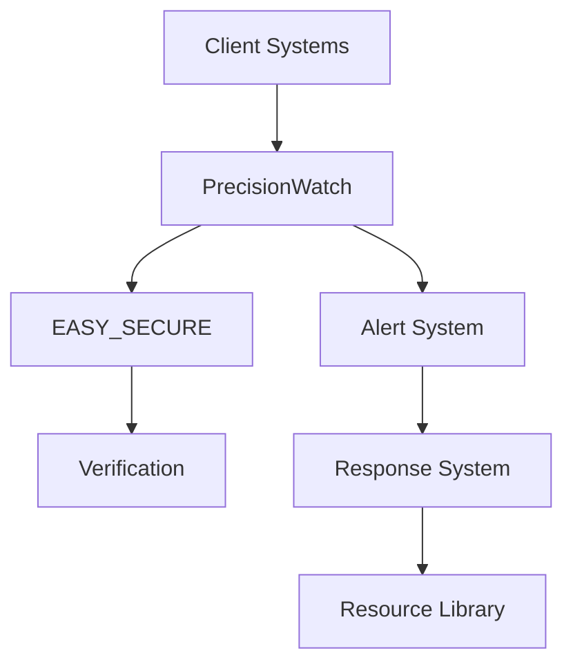

# System Architecture Documentation

## Overview

This document outlines the architecture of our zero-budget, AI-assisted business protection system. Built using Windsurf Cascade IDE and Claude 3.5 Sonnet, our system leverages sophisticated monitoring and backup capabilities while maintaining simplicity in deployment.

## Core Systems

### 1. PrecisionWatch™ System
```yaml
Purpose: Real-time system monitoring and protection
Components:
  Monitor:
    - System health checks
    - Performance metrics
    - Resource utilization
    - Error detection
  
  Alert System:
    - Real-time notifications
    - Priority classification
    - Response automation
    - Issue tracking

Implementation:
  - Python-based monitoring
  - Local system agents
  - CloudFlare integration
  - Zero-cost deployment
```

### 2. EASY_SECURE™ Backup
```yaml
Purpose: Enterprise-grade backup with verification
Components:
  Backup Engine:
    - Incremental backups
    - Data verification
    - Compression
    - Encryption

  Verification:
    - SHA-256 hashing
    - Metadata validation
    - Integrity checks
    - Recovery testing

Implementation:
  - Python backup scripts
  - Local storage first
  - CloudFlare R2 integration
  - Automated verification
```

### 3. Resource Library
```yaml
Purpose: Business tool and template distribution
Structure:
  /templates:
    - Document templates
    - Email templates
    - Marketing materials
    - Process guides
  
  /tools:
    - Automation scripts
    - Calculators
    - Tracking tools
    - Analysis tools

Implementation:
  - Static file hosting
  - CloudFlare Pages
  - Version control
  - Access management
```

## System Integration

### Data Flow


### Communication
```yaml
Internal:
  - REST APIs
  - WebSocket monitoring
  - Event-driven alerts
  - Status updates

External:
  - Client dashboard
  - Email notifications
  - SMS alerts
  - Status page
```

## Deployment Architecture

### Infrastructure
```yaml
Hosting:
  - CloudFlare Pages (Free Tier)
  - GitHub (Free Tier)
  - Local Processing
  - Edge Computing

Security:
  - CloudFlare SSL
  - Access Controls
  - Data Encryption
  - Audit Logging
```

### Scaling Strategy
```yaml
Phase 1:
  - Local processing
  - Basic monitoring
  - Essential backups
  - Core resources

Phase 2:
  - Enhanced monitoring
  - Advanced backups
  - More resources
  - Automation

Phase 3:
  - Full automation
  - Advanced features
  - Custom solutions
  - API integration
```

## Development Approach

### AI-Assisted Development
```yaml
Tools:
  - Windsurf Cascade IDE
  - Claude 3.5 Sonnet
  - GitHub Copilot
  - CloudFlare Tools

Process:
  1. Problem identification
  2. AI prompt engineering
  3. Code generation
  4. Manual review
  5. Testing
  6. Deployment
```

### Quality Assurance
```yaml
Testing:
  - Automated tests
  - Manual verification
  - Load testing
  - Security scanning

Monitoring:
  - Performance metrics
  - Error tracking
  - Usage analytics
  - Client feedback
```

## Cost Management

### Zero-Budget Strategy
```yaml
Infrastructure:
  - Use free tiers
  - Local processing
  - Edge computing
  - Resource optimization

Development:
  - AI assistance
  - Open-source tools
  - Community resources
  - Manual oversight
```

### Resource Utilization
```yaml
Priority:
  1. Essential services
  2. Core features
  3. Basic automation
  4. Enhanced features

Optimization:
  - Code efficiency
  - Resource sharing
  - Cache utilization
  - Load balancing
```

## Future Expansion

### Roadmap
```yaml
Technical:
  - Enhanced monitoring
  - Advanced automation
  - API development
  - Custom solutions

Business:
  - More templates
  - Industry tools
  - Integration options
  - Partner features
```

### Sustainability
```yaml
Revenue Model:
  - Monthly subscriptions
  - Setup services
  - Custom solutions
  - Resource access

Growth Plan:
  - Reinvest profits
  - Expand features
  - Add integrations
  - Scale services
```
